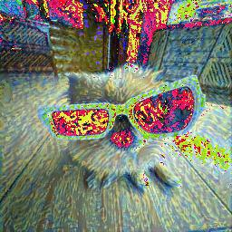

# 🎨 Neural Style Transfer - CodTech Internship Task 3

This project implements **Neural Style Transfer** using **PyTorch**, allowing a user to apply the artistic style of one image (e.g., Van Gogh’s *Starry Night*) onto another image (like a dog photo 🐶 wearing cool glasses).

---

## ✅ Task Objective

> Implement a Neural Style Transfer model to apply artistic styles to photographs using deep learning and a pretrained VGG19 model.

---

## 📁 Files Included

| File Name                 | Description                                  |
|--------------------------|----------------------------------------------|
| `content.jpg`            | Original input image                         |
| `style.jpg`              | Artistic style image                         |
| `output.jpg`             | Stylized result image                        |
| `Neural_Style_Transfer.ipynb` | Google Colab Notebook with full implementation |

---

## 🛠️ Technologies Used

- Python
- PyTorch
- Google Colab
- torchvision (VGG19)
- matplotlib / PIL

---

## 🚀 Output Sample

---

## 🙋‍♀️ Developed by

**Darsh Sharma**  
B.Tech Computer Science Student  
CodTech Intern 2025
